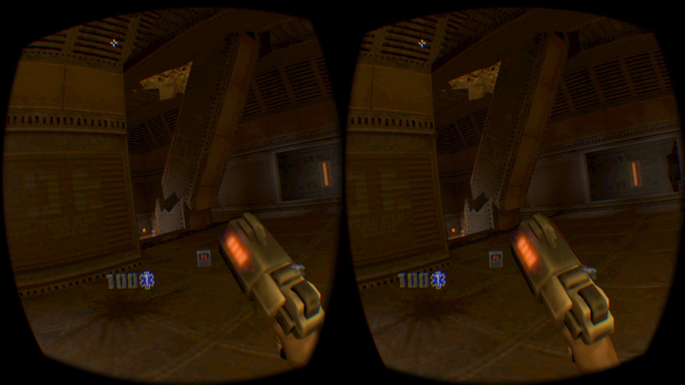

# Quake2VR with 3dRudder controller for Oculus Rift


## Movement with the 3dRudder
* Strafe left/right
* Forward/Backward
* Rotation left/right

## Download Release : [Quake2VR3dRudder-2.0.0-full.zip](https://github.com/3DRudder/Quake2VR/releases/latest)

## Or follow this instructions
* Project base : https://github.com/q2vr/quake2vr/tree/libovr-1.xx
  * Download Release ```Quake2VR-2.0.0-bin.zip```(https://github.com/q2vr/quake2vr/releases/tag/v2.0.0a) unzip it to your preferred directory
  * Optionally download the extra's package and unzip it to the same folder.
  * Copy the following files from your Quake II baseq2 folder into the new baseq2 folder:
    * pak0.pak (overwrite it if you downloaded the shareware version)
    * players\ (optional - only if you want to play multiplayer. overwrite it if you downloaded the shareware version)
    * videos\ (optional - only if you want cinematics)
  * If you have the CD audio soundtrack in .ogg format you can optionally place these files in baseq2\music\. Music files need to be named track02.ogg to track11.ogg.
  * Run quake2vr or choose one of the links provided in the extras pack.
  
You can alternately just copy the contents of the extracted Quake2VR directory on top of an existing Quake II installation, however there is always the risk that this breaks the original installation.

If your Oculus Rift is connected and powered on it will enable support automatically at launch, but you can also enable Rift support by accessing the console using ~ and entering vr_enable. When it initializes it will attempt to locate the display that the Rift is configured as and use it, but if that fails it will default to the primary monitor.

* 3dRudder configuration
  * Download ```gamecontrollerdb.txt``` (https://github.com/3DRudder/SDL_GameControllerDB) and place it in ```baseq2``` folder of Quake2VR
  * 3dRudder controller must be in joystick mode
  * In the Options:
    * Controls -> Gamepad -> Thumb stick mode -> select move/view
    * Virtual Reality -> Aim Mode -> select decoupled view/aiming
    * Virtual Reality ->Confort turning -> select disabled     
  


